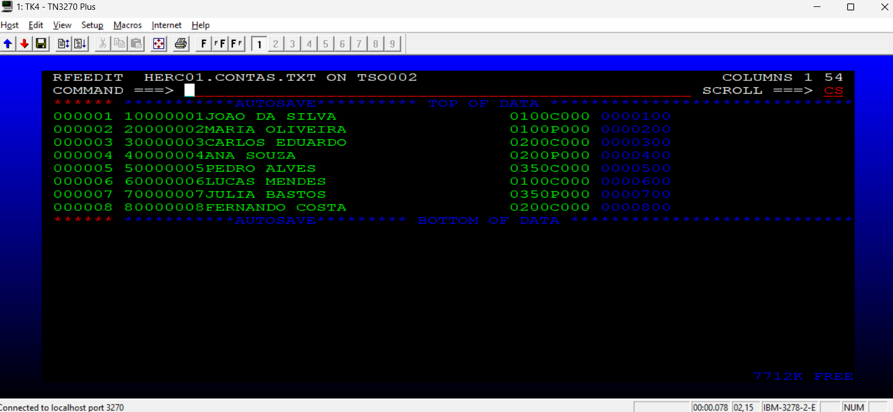
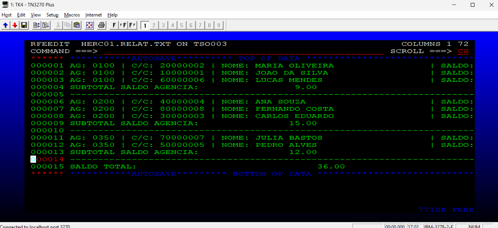

# Projeto 4: Processamento de Relatórios Bancários (COBOL)

Este projeto consiste em um programa em COBOL desenvolvido para o processamento em lote (batch) de um arquivo de contas bancárias, gerando um relatório formatado com quebra de controle por agência e totalização geral.

## Funcionalidades
- **Ordenação**: Utiliza JCL e utilitário SORT para organizar as contas por agência.
- **Validação**: Filtra registros inválidos (saldos negativos ou agências zeradas).
- **Relatório Gerencial**: Gera um arquivo de saída (`RELAT.TXT`) com:
  - Listagem detalhada de cada conta.
  - Subtotais de saldo por agência.
  - Saldo total consolidado do banco.

## Tecnologias
- Linguagem: COBOL (Mainframe/OS/360)
- Processamento: JCL (Job Control Language)
- Ambiente: TSO/ISPF, HERCULES

## Estrutura do Repositório
- `PROG04.cob`: Código fonte do programa COBOL.
- `JCLPROJ4.jcl`: JCL para compilação e execução.
- `CONTAS.TXT`: Arquivo de dados de entrada.
- `assets/`: Pasta contendo evidências visuais do projeto.

## Como Executar
1. Certifique-se de que o arquivo `CONTAS.TXT` está no dataset configurado no JCL.
2. Submeta o `JCLPROJ4` no seu ambiente mainframe.
3. O relatório será gerado no dataset `HERC01.RELAT.TXT`.

## Evidências de Execução
Abaixo, registros que comprovam o funcionamento correto do processamento Batch e a validação de dados:

### 1. Arquivo de Entrada

### 2. Arquivo de Saída

### 3. Execução 

